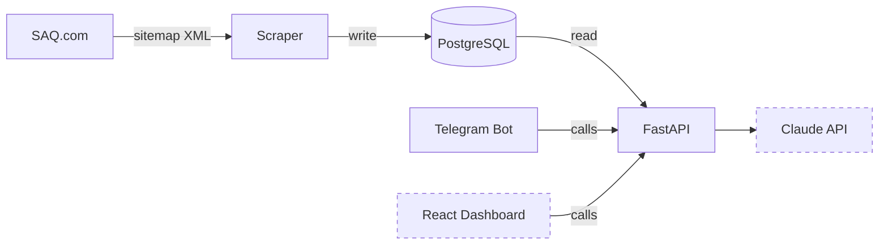

# SAQ Sommelier

AI-powered wine recommendation engine built on the SAQ (Quebec liquor board) product catalog.

[](https://github.com/vpatrin/saq-sommelier/actions/workflows/ci.yml)
[](CHANGELOG.md)

[](https://docs.astral.sh/ruff/)


- 🍷 Scrapes ~38k products from the SAQ public sitemap into PostgreSQL
- 🔍 FastAPI catalog API with search, filtering, and restock alerts
- 🤖 Telegram bot for browsing, watching, and notifications
- 📍 In-store availability lookup (planned)
- 💬 Natural language recommendations via Claude RAG (planned)

## Architecture



*Dashed = planned. See [docs/ARCHITECTURE.md](docs/ARCHITECTURE.md) for full details.*

## Quick start

```bash
make install              # install all dependencies (Poetry)
cp .env.example .env      # defaults work as-is
make run-db               # start PostgreSQL (localhost:5432)
make migrate              # create database tables
make dev-scraper          # populate the database (~38k products)
make dev-backend          # start the backend (localhost:8001)
```

## Development

```bash
make lint          # ruff check
make format        # ruff format
make test          # pytest (all services)
make coverage      # tests + coverage badges
make migrate       # alembic upgrade head
make build         # docker build
make run / down    # docker compose (full stack / stop)
```

See [docs/DEVELOPMENT.md](docs/DEVELOPMENT.md) for database setup options and full workflow.

## Documentation

- [Architecture](docs/ARCHITECTURE.md) — system design, project structure, tech decisions
- [Data Flow](docs/DATA_FLOW.md) — three-schema boundary design
- [Development](docs/DEVELOPMENT.md) — database setup, environment config, dev workflow
- [Migrations](docs/MIGRATIONS.md) — Alembic setup, workflow, and troubleshooting
- [Scraper Operations](docs/SCRAPER.md) — production scheduling, failure recovery, logging
- [Store Availability](docs/STORE_AVAILABILITY.md) — SAQ AJAX endpoints, store directory, stock checks
- [Telegram Bot](docs/TELEGRAM_BOT.md) — bot design, commands, API dependencies
- [Roadmap](docs/ROADMAP.md) — project phases, discipline roadmaps, and timeline
- [Changelog](CHANGELOG.md) — release history

## Legal

SAQ data is scraped ethically via their public sitemap (listed in `robots.txt`). Rate-limited to 2s between requests with transparent bot identification.

## License

MIT
