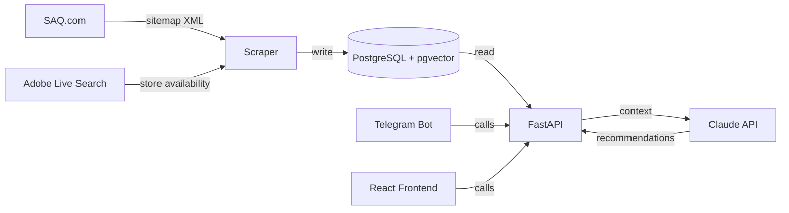

# SAQ Sommelier

Wine discovery and recommendation platform for the SAQ (Quebec liquor board) catalog.

[](https://github.com/vpatrin/saq-sommelier/actions/workflows/ci.yml)
[](CHANGELOG.md)

[](https://docs.astral.sh/ruff/)


- 🍷 Scrapes ~38k products from the SAQ public sitemap into PostgreSQL
- 🔍 FastAPI catalog API with search, filtering, and restock alerts
- 🤖 Telegram bot with availability alerts and AI recommendations
- 📍 In-store availability for Montreal stores (daily refresh via SAQ's catalog API)
- 💬 Natural language wine recommendations via Claude + pgvector semantic search
- 🌐 Web frontend at coupette.club (React + Vite)

## Architecture


```mermaid
graph LR
    SAQ[SAQ.com]
    Adobe[Adobe Live Search]
    Scraper[Scraper]
    DB[(PostgreSQL + pgvector)]
    API[FastAPI]
    Claude[Claude API]
    Bot[Telegram Bot]
    Web[React Frontend]

    SAQ -- sitemap XML --> Scraper
    Adobe -- store availability --> Scraper
    Scraper -- write --> DB
    DB -- read --> API
    API -- context --> Claude
    Claude -- recommendations --> API
    Bot -- calls --> API
    Web -- calls --> API

```

*See [docs/ARCHITECTURE.md](docs/ARCHITECTURE.md) for full details.*

## Quick start

```bash
make install              # install all dependencies (Poetry)
cp .env.example .env      # defaults work as-is
make run-db               # start PostgreSQL (localhost:5432)
make migrate              # create database tables
make dev-scraper          # populate the database (~38k products)
make dev-backend          # start the backend (localhost:8001)
```

## Development

```bash
make lint          # ruff check
make format        # ruff format
make test          # pytest (all services)
make coverage      # tests + coverage badges
make migrate       # alembic upgrade head
make build         # docker build
make run / down    # docker compose (full stack / stop)
```

See [docs/DEVELOPMENT.md](docs/DEVELOPMENT.md) for database setup options and full workflow.

## Documentation

- [Architecture](docs/ARCHITECTURE.md) — system design, schema boundaries, key decisions
- [Development](docs/DEVELOPMENT.md) — local setup, workflows, migrations
- [Operations](docs/OPERATIONS.md) — production scheduling, scraper ops, failure recovery
- [Production](docs/PRODUCTION.md) — VPS state, deployment, backups, security hardening
- [Security](docs/SECURITY.md) — auth model, threat model, CI scanning, known limitations
- [Engineering](docs/ENGINEERING.md) — testing, observability, SRE, platform, ML/MLOps
- [Roadmap](docs/ROADMAP.md) — product phases and timeline
- [Changelog](CHANGELOG.md) — release history
- [specs/DATA_PIPELINE.md](docs/specs/DATA_PIPELINE.md) — data pipeline spec (Adobe Live Search, HTML scrape)
- [specs/RECOMMENDATIONS.md](docs/specs/RECOMMENDATIONS.md) — Phase 6 RAG + Claude architecture spec
- [specs/TELEGRAM_BOT.md](docs/specs/TELEGRAM_BOT.md) — Telegram bot design and commands
- [specs/MCP_SERVER.md](docs/specs/MCP_SERVER.md) — Phase 7 MCP server + Claude-as-backend architecture

## Legal

SAQ data is scraped ethically via their public sitemap (listed in `robots.txt`). Rate-limited to 2s between requests with transparent bot identification.

## License

MIT
