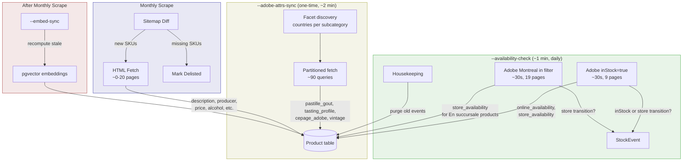

# Data Pipeline — Spec

Phase 6 prerequisite. Replaces `STORE_AVAILABILITY.md` and `CATALOG_AVAILABILITY.md`.

Cross-reference: [ROADMAP.md](../ROADMAP.md) Phase 6, [RECOMMENDATIONS.md](RECOMMENDATIONS.md) for RAG architecture + Claude integration.

---

## TL;DR

Three CLI flags, each with a single responsibility. `--check-watches` is absorbed into `--availability-check`.

| Flag | Runs | What it does | Scope |
| --- | --- | --- | --- |
| `--availability-check` | Daily (2am) | Refreshes `online_availability` + `store_availability` from Adobe Live Search | All categories — wine + spirits + beer (online: ~4k, Montreal stores: ~9.5k) |
| `--adobe-attrs-sync` | One-time (re-run manually if needed) | Enriches wine products with tasting profiles, pastille, cepage, vintage from Adobe | Wine only (~30.9k) |
| `--embed-sync` | After monthly scrape | Recomputes pgvector embeddings where `attribute_hash != embedded_hash` | Wine only (~30.9k initial, ~0-20 incremental) |

**Monthly HTML scrape** (existing, modified): sitemap diff → fetch description + static fields for new SKUs only (~0-20 pages). No longer tracks availability.

**Data sources:** Adobe Live Search (91 attributes/product, no price, no description) + HTML scrape (description, price, alcohol, sugar — CDN-cached). Magento GraphQL and AJAX store locator are dropped.

**Wine-only scope:** Bot and future React app focus on wine (vin-rouge, vin-blanc, vin-rosé, champagne/mousseux, porto/fortifié, saké — ~30.9k products). Full catalog (~38k) stays in DB but only wine is enriched and embedded.

**Montreal MVP:** In-store availability refreshed for ~64 consumer Montreal stores only. Expand by metro area when needed.

**Partition strategy for Adobe's 10k pagination cap:**

- Small subcategories (vin-blanc, vin-rosé, champagne, porto, saké): single query each, no partitioning
- Vin-rouge (18,885): partition by country (facet-discovered, 34 countries sum exactly)
- France vin-rouge (10,807): sub-partition by price range ($0-20, $20-50, $50-100, $100-500, $500+) — covers 99.98%
- `--availability-check`: `inStock=true` (9 pages) + Montreal `in` filter (19 pages) — two queries

**Writer ownership:** Each column has exactly one writer. No overlap between CLI flags. See [Schema Changes](#schema-changes) for the full mapping.

---

## Data Sources

SAQ runs Magento 2 with Adobe Commerce Live Search and Fastly CDN. Two data sources, each with a distinct role:

| Source | What it gives | What it can't | Cost per run |
|---|---|---|---|
| **Adobe Live Search** | 91 attributes/product (tasting profiles, cepage, pastille, stores), `inStock`, `lowStock`, `store_availability_list` | Price, description | ~9 pages for inStock (~30s); up to ~24 pages for full catalog partitions |
| **HTML scrape** | `description`, `alcohol`, `sugar`, `producer`, `classification`, `size`, `price` | Stale availability (CDN-cached 24-48h) | ~0-20 pages/month (new SKUs only) |

### Adobe Live Search API

```
POST https://catalog-service.adobe.io/graphql

Headers:
  x-api-key: 7a7d7422bd784f2481a047e03a73feaf
  Magento-Environment-Id: 2ce24571-9db9-4786-84a9-5f129257ccbb
  Magento-Website-Code: base
  Magento-Store-Code: main_website_store
  Magento-Store-View-Code: fr
```

SAQ's storefront uses Adobe Commerce Live Search, a SaaS catalog service separate from the Magento GraphQL endpoint. The API key and environment ID are public — embedded in every SAQ page load.

**GraphQL query — `productSearch`:**

```graphql
query {
  productSearch(
    phrase: ""
    filter: [{ attribute: "inStock", eq: "true" }]
    page_size: 500
    current_page: 1
  ) {
    total_count
    page_info { current_page page_size total_pages }
    items {
      productView {
        sku
        name
        inStock
        lowStock
        url
        urlKey
        lastModifiedAt
        description          # Always empty — SAQ doesn't populate this
        shortDescription     # Always empty
        attributes {         # 91 attributes per product
          name
          value
        }
      }
    }
  }
}
```

**Note:** `description` and `shortDescription` return empty strings for all products tested. HTML scraping remains the only source for product descriptions.

**Pagination cap:** Hard limit at **10,000 products** (page_size × current_page). Queries with >10k results error on page 21+ at 500/page. Partition with filters to stay under the cap.

**No price field:** `ProductView` schema confirmed via introspection — no `price`, `priceRange`, or `prices` field exists. Price is available via Magento GraphQL and HTML scrape; the pipeline uses monthly HTML as the primary source (SAQ prices are regulated, rarely change).

**Filterable attributes (48):** Full list via `attributeMetadata` query. Key ones:

| Attribute | Type | Example values |
|---|---|---|
| `inStock` | bool | `"true"` / `"false"` |
| `availability_front` | string | `"En ligne"`, `"En succursale"`, `"Épuisé"`, `"Indisponible"`, `"Disponible bientôt"` |
| `categories` | path | `"produits"`, `"produits/vin/vin-rouge"` |
| `catalog_type` | int | `"1"` (main retail catalog) |
| `store_availability_list` | string | Store ID, e.g. `"23101"` |
| `pays_origine` | string | `"France"`, `"Italie"`, ... (89 countries) |
| `region_origine` | string | `"Bourgogne"`, `"Bordeaux"`, ... (198 regions) |
| `cepage` | string | `"Pinot noir"`, `"Chardonnay"`, ... (100+ grapes) |
| `pastille_gout` | string | `"Fruité et vif"`, `"Aromatique et charnu"`, ... (28 profiles) |
| `millesime_produit` | string | `"2020"`, `"2023"`, ... (75 vintages) |
| `nouveaute_marketing` | string | `"Nouvel arrivage"` (129), `"Nouveauté"` (23) |
| `latest_offers` | string | `"Rabais"` (163), `"Points bonis"` (23) |
| `price` | range | Filterable but not returned as a field |
| `pourcentage_alcool_par_volume` | range | Numeric filter |
| `taux_sucre_filter` | range | Numeric filter |
| `nom_producteur` | string | Producer name |
| `particularite` | string | `"Produit bio"`, `"Nature"`, `"Biodynamique"`, ... |

**Sortable:** `price`, `name`, `pourcentage_alcool_par_volume`, `taux_sucre_filter`, `position`, `relevance`.

**Attributes per product (91).** Key ones for RAG:

| Attribute | Example | Notes |
|---|---|---|
| `pastille_gout` | `"Aromatique et souple"` | SAQ's taste classification — 28 profiles |
| `cepage` | `["Malbec", "Syrah"]` | Array for blends |
| `cepage_text` | `{"MALB":"96","SYRA":"4"}` | Blend percentages |
| `pays_origine` | `"Chili"` | |
| `region_origine` | `"Valle Central"` | |
| `sous_region_origine_1` | `"Vallée de Colchagua"` | Sub-region |
| `appellation` | `"Apalta"` | |
| `millesime_produit` | `"2023"` | Vintage year |
| `nom_producteur` | `"Viu Manent S.A."` | |
| `couleur` | `"Rouge"` | |
| `qualite` | `"Reserva"` | Designation |
| `designation_reglementee` | `"Denominación de origen (DO)"` | |
| `pourcentage_alcool_par_volume` | `"13.500000"` | Numeric string |
| `taux_sucre` | `"1.9"` | g/L |
| `format_contenant_ml` | `"750"` | |
| `identite_produit` | `"Vin rouge"` | Product type |
| `portrait_acidite` | `"présente"` | Tasting: acidity |
| `portrait_arome` | `["cassis", "prune", "sous-bois"]` | Tasting: aromas (array) |
| `portrait_bois` | `"équilibré"` | Tasting: wood |
| `portrait_bouche` | `"généreuse"` | Tasting: palate |
| `portrait_corps` | `"mi-corsé"` | Tasting: body |
| `portrait_sucre` | `"sec"` | Tasting: sweetness |
| `portrait_potentiel_de_garde` | `"À boire ou à garder 4 ans"` | Aging potential |
| `portrait_temp_service_de` | `"16"` | Serving temp min (°C) |
| `portrait_temp_service_a` | `"18"` | Serving temp max (°C) |
| `famille_accords` | `"039"` | Food pairing family code |
| `store_availability_list` | `["23002", "23004", ...]` | All stores carrying the product (see type note below) |
| `reviews_average_rating` | `"80"` | Out of 100 |
| `reviews_count_rating` | `"69"` | |
| `disponibilite_date_debut` | `"2025-08-19 00:00:00"` | Available from |
| `nouveaute_marketing` | `""` | New arrival flag |
| `latest_offers` | `""` | Promo flag |
| `type_bouchon` | `"Capsule à vis"` | Cork type |
| `type_listing` | `"Courant achat continu"` | Listing type |
| `statut_produit` | `"Actif"` | Active/inactive |

**Type polymorphism quirk:** Several Adobe attributes return a **plain string** when there's one value but a **JSON array** when there are multiple. Confirmed on `store_availability_list` (string `"23101"` for 1 store, array `["23004", "23050", ...]` for many) and `availability_front` (string `"En succursale"` vs array `["En ligne", "En succursale"]`). The parser must normalize these to always-array.

### Deprecated / Not Used

**Magento GraphQL** (`POST https://www.saq.com/graphql`) — provides `magento_id`, `price`, `stock_status`. Not used: `magento_id` is only needed for the AJAX store locator (dropped), price comes from HTML, stock status comes from Adobe. `custom_attributesV2` returns Internal Server Error on SAQ's installation.

**AJAX Store Locator** (`GET /fr/store/locator/ajaxlist?context=product&id={magento_id}`) — only source of per-store `qty` (exact shelf count). Dropped: Adobe `store_availability_list` provides boolean store presence, which is sufficient for recommendations and watch alerts. Exact qty adds complexity (Magento GraphQL dependency for `magento_id`, ~6 min per run) for marginal value.

### HTML Scrape

Two data sources per product page, merged:

- **JSON-LD** (`<script type="application/ld+json">`): `name`, `sku`, `description`, `category`, `image`, `price`, `availability`, `rating`, `review_count`
- **HTML attributes** (`<ul class="list-attributs">`): `country`, `size`, `region`, `appellation`, `designation`, `classification`, `grape`, `alcohol`, `sugar`, `producer`

The only source for `description` — both Adobe Live Search and Magento GraphQL return empty. Also the only source for `alcohol` (as display string like "13.5%"), `sugar` (as display string), `producer` name as displayed, `classification`, `size`.

Rate limited at 2-3s between requests. SAQ pages are CDN-cached — `availability` and `price` from HTML can be stale by 24-48h.

---

## Verified Numbers (2026-03-04)

Tested against live Adobe Live Search API. These are hard numbers, not estimates.

### Catalog size

| Filter | Count | Under 10k cap? |
|---|---|---|
| Unfiltered (all products in Adobe) | 39,844 | No |
| `categories=produits` (SAQ retail catalog) | 36,820 | No |
| **`inStock=true`** | **4,077** | **Yes (9 pages)** |
| `availability_front=En ligne` | 6,848 | Yes (14 pages) |
| `availability_front=En succursale` | 11,232 | No |
| **`En ligne + catalog_type=1`** | **3,708** | **Yes — matches SAQ.com** |
| **`En ligne OR En succursale`** | **11,577** | **No** |
| `Épuisé` (sold out) | 17,864 | No |
| `Indisponible` (unavailable) | 6,942 | Yes (14 pages) |
| `Disponible bientôt` (coming soon) | 355 | Yes (1 page) |
| `Nouveauté` + `Nouvel arrivage` | 152 | Yes |
| `Rabais` (on sale) | 163 | Yes |

#### Wine-only scope (bot + recommendations)

| Category path | Count | Under 10k? |
|---|---|---|
| `produits/vin/vin-rouge` | 18,885 | No — partition by country |
| `produits/vin/vin-blanc` | 9,410 | Yes — error if exceeded |
| `produits/vin/vin-rose` | 518 | Yes |
| `produits/champagne-et-mousseux` | 1,659 | Yes |
| `produits/porto-et-vin-fortifie` | 313 | Yes |
| `produits/sake` | 140 | Yes |
| **Embedded total** | **~30,925** | — |
| `produits/spiritueux` | 4,415 | — (not embedded) |
| `produits/biere` | 352 | — (not embedded) |

The bot and future React app are wine-scoped. Only wine + saké products (~30.9k) are enriched via `--adobe-attrs-sync` and embedded. Spirits, beer, cider, etc. stay in the DB (scraper already has them) but are excluded from recommendations.

Subcategory paths match the bot's `CATEGORY_GROUPS` (rouge, blanc, rosé, bulles, fortifié, saké). `vin-nature` (2,081) and orange wine (~321) are cross-tagged within rouge/blanc/rosé — not separate partitions, captured automatically by the parent subcategory queries.

**Key insight:** `inStock` = "purchasable on saq.com right now" (4,077). A wine can be `inStock=false` but available in 50 physical stores — and Adobe still populates `store_availability_list` for it. `availability_front=En succursale` (11,232) captures everything available in at least one store. The union (11,577) is the full "available somewhere" catalog. Store-level filtering works across the entire available catalog, not just online products.

**SAQ.com's actual online count:** `availability_front=En ligne + categories=produits + catalog_type=1` = **3,708** — confirmed against the SAQ website.

### Pagination cap

Hard limit at 10,000 items. `page_size=500 × current_page=20` works; page 21 errors:

```
"Pagination is limited to 10000 products. Please use filters to refine your search."
```

`total_count` and `total_pages` report the real total (e.g. 39,844 / 80 pages) but you can't access beyond page 20.

### Partition strategy for >10k queries

Filters compose correctly (AND logic). Every partition below stays under 10k:

| Partition | Count | Pages |
|---|---|---|
| `inStock=true` (all online) | 4,077 | 9 |
| `pays_origine=France` (all statuses) | 19,054 | No — needs sub-partitioning |
| `pays_origine=Italie` | 5,308 | 11 |
| Per-store (`store_availability_list=23101`) | ≤4,085 | ≤9 |
| Montreal stores (`in` filter, 64 stores) | 9,487 | 19 |

**For `--availability-check`:** `inStock=true` (9 pages) + Montreal `in` query (19 pages). Two queries.

**For `--adobe-attrs-sync`:** Wine-only, partitioned by subcategory + `pays_origine` (facet-discovered). Vin-blanc (9,410), vin-rosé (518), champagne/mousseux (1,659), porto/fortifié (313), and saké (140) each fit in a single query — no partitioning needed. Vin-rouge (18,885) partitions by country — France (10,807) sub-partitions by price range ($0-20: 427, $20-50: 2,415, $50-100: 2,590, $100-500: 4,285, $500+: 1,088). All partitions verified under 10k.

### Performance verified

| Query | Time | Pages |
|---|---|---|
| Unfiltered, 500/page | ~1.2s/page | — |
| `inStock=true`, 500/page | ~1.4s first, ~0.4s subsequent | 9 |
| Per-store, 500/page | ~2.5s/page | 6-9 |
| Facets query | ~0.9s | 1 |

### Store inventory

| Query | Products | Pages |
|---|---|---|
| Single store (23101 Mont-Royal Est) | 2,684 | 6 |
| Single store (23066 Beaubien) | 3,927 | 8 |
| 5 Montreal stores (`in` filter) | 5,593 | 12 |
| 20 Montreal stores (`in` filter) | 6,325 | 13 |
| **64 Montreal stores (`in` filter)** | **9,487** | **19** |

The `in` operator on `store_availability_list` returns the union of products at any listed store. Diminishing returns from store overlap — heavy product overlap across Montreal stores. 64 consumer stores (excluding 2 B2B "restaurateurs") = 9,487, under 10k with ~500 headroom.

---

## What We Have Today (Phase 5b)

Two separate scraper modes, both running in production:

**Weekly HTML scrape** (→ monthly in Phase 6) — catalog attribute sync. Fetches sitemap, compares `lastmod` vs DB `updated_at`, scrapes changed/new product pages. Detects delisted products (in DB but gone from sitemap). Typical run: ~50-200 pages (incremental). Writes to `Product` table.

**Daily `--check-watches`** — availability for watched SKUs only. Resolves `magento_id` + `stock_status` via Magento GraphQL (batches of 20). Fetches per-store `qty` via AJAX (targeted = 1 request per preferred store). Diffs against `ProductAvailability` snapshot, emits `StockEvent` on transitions. Runtime: ~5 min for 50 SKUs × 3 stores.

**Tables:** `Product`, `Store`, `Watch`, `UserStorePreference`, `ProductAvailability`, `StockEvent`.

**Limitations for Phase 6:**
- `Product.availability` is CDN-cached HTML — unreliable for real-time status
- `ProductAvailability` only covers watched SKUs (~tens of products) — RAG needs the full catalog
- No tasting profiles (`portrait_*`), no `pastille_gout`, no structured `cepage` array
- No `store_availability_list` per product (which stores carry it)
- Magento GraphQL + AJAX dependency adds complexity for marginal value (exact shelf qty vs boolean presence)

---

## Phase 6 Architecture

### What changes

| Concern | Phase 5b (current) | Phase 6 (this spec) |
|---|---|---|
| Online availability | Weekly HTML (CDN-cached, stale) | `--availability-check` (Adobe `inStock`) |
| Store presence | AJAX per watched SKU only (exact qty) | `--availability-check` (Adobe per-store `store_availability_list`, preferred stores) |
| Price | Weekly HTML | Monthly HTML (unchanged — SAQ prices are regulated, rarely change) |
| Tasting profiles | Not captured | `--adobe-attrs-sync` (`portrait_*` attributes) |
| Pastille de goût | Not captured | `--adobe-attrs-sync` (`pastille_gout`) |
| Cepage | HTML string `"Cabernet Sauvignon / Merlot"` | `--adobe-attrs-sync` (Adobe array) + HTML string kept |
| Monthly scrape scope | All ~38k sitemap entries | New SKUs only (description + static fields) |
| `ProductAvailability` table | Exists (watched SKUs only) | **Dropped** — columns merged into `Product` |
| Magento GraphQL + AJAX | Used for `magento_id` + per-store qty | **Dropped** — Adobe covers availability + store presence |
| Embedding support | None | `attribute_hash` + `embedded_hash` on `Product` |

### Pipeline overview

```
One-time setup:
  1. Full HTML scrape     → ensure all products have description          (existing scraper)
  2. --adobe-attrs-sync   → partitioned Adobe fetch for wine products     (~90 queries, ~2 min)
  3. --embed-sync         → initial embedding of ~30.9k wine products

--availability-check (~1 min, daily at 2am):
  1a. Adobe inStock=true  → online avail + store lists                   (~30s, ~4k products)
  1b. Adobe Montreal `in` → store avail for En succursale products       (~30s, ~9.5k products)
  2.  Watch diff          → compare store_availability vs user prefs → StockEvent
  3.  Housekeeping        → purge old events

Monthly scrape:
  1. Sitemap diff       → detect new + delisted SKUs                    (same as today)
  2. HTML fetch         → description + static fields                   (new SKUs only, ~0-20 pages)

After monthly scrape:
  --embed-sync         → recompute pgvector embeddings for new/changed products (~0-20)
```

Two external dependencies: Adobe Live Search (daily) and SAQ HTML (monthly). No Magento GraphQL, no AJAX.

### Data flow diagram



---

## Availability Check

Runs at 2am via systemd timer. Single CLI entry point: `python -m src --availability-check`. Runtime ~1 min.

### Step 1 — Adobe Live Search (~1 min)

**Purpose:** Refresh online availability and store presence for all products users can act on.

**Scope: all categories.** `inStock=true` and Montreal `in` queries return wine + spirits + beer + cider. All products get their availability updated — not just wine. This is intentional: availability is useful for watch alerts on any product, and filtering by category would add complexity for no benefit.

Two query sets:

**1a. `inStock=true` (~4k products, ~9 pages, ~30s)**

Covers all online-purchasable products. For each product, extract availability only:

- `inStock` → `Product.online_availability`
- `store_availability_list` → `Product.store_availability` JSONB array (all store IDs carrying this product)

Wine attributes (`pastille_gout`, `portrait_*`, `cepage`, `vintage`) are in the Adobe response but **ignored** — `--adobe-attrs-sync` owns those columns.

**1b. Montreal stores — single `in` query (~9.5k products, ~19 pages, ~30s)**

**MVP: Montreal only.** Query Adobe with `store_availability_list` `in` filter containing all ~64 consumer-facing Montreal store IDs. Returns the union of products available at any listed store. Verified at 9,487 products — under 10k cap with ~500 headroom.

```graphql
filter: [{ attribute: "store_availability_list", in: ["23101", "23066", "23132", ...] }]
```

Covers En succursale products (store-only, not online) at Montreal stores. Same extraction as 1a (availability only — attributes ignored). Products already seen in 1a are skipped (dedup by SKU). Products from 1b that are `inStock=false` get `online_availability=false` explicitly.

**Expansion:** When supporting stores outside Montreal, batch by metro area (e.g. Quebec City, Laval). Each metro area stays under 10k. Don't combine all ~400 stores in one `in` query — that would exceed the pagination cap.

**No embedding work here.** `--availability-check` writes availability only — neither column is embedded. `attribute_hash` and `embedded_hash` are managed by `--embed-sync` (run after monthly scrape).

**Products outside both query sets** (not online AND not at any preferred store) keep stale availability. Their store data may drift but is irrelevant for recommendations since no user has those stores. Their attributes (from `--adobe-attrs-sync`) are stable — wine identity doesn't change.

### Step 2 — Watch Transition Detection

**Purpose:** Detect availability changes for watched products and emit alerts.

No network calls — purely in-DB comparison using data from Step 1.

```
1. Load watched SKUs + user preferred stores
2. For each watched product:
   a. Online transition: compare previous inStock vs new → StockEvent(saq_store_id=NULL)
   b. Store transition: compare previous store_availability vs new,
      cross-reference user preferred stores → StockEvent(saq_store_id=X)
3. Products that disappeared from Adobe results (inStock was true, now absent):
   mark as unavailable, emit StockEvent
```

**Note on `store_availability_list` scope:** Adobe populates this field for ALL available products, regardless of `inStock`. A product with `inStock=false` + `availability_front=En succursale` still has store IDs in `store_availability_list`. `--availability-check` covers both: step 1a gets `inStock=true` products, step 1b gets En succursale products at preferred stores. Store-level alerts work for the full available catalog at preferred stores.

### Step 3 — Housekeeping

- Purge stock events older than 7 days
- Log batch summary (products updated, events emitted, errors)

---

## One-time Adobe Backfill

`python -m src --adobe-attrs-sync` — run once to populate Adobe attributes for wine products.

**Purpose:** Enrich ~30.9k wine products with Adobe-only attributes for embedding quality. `--availability-check` only reaches `inStock=true` (~4k) + Montreal store products. The rest of the wine catalog has `portrait_*`, `pastille_gout`, `cepage`, `vintage` data in Adobe but won't be reached by the daily query. Since all wine products are embedded, they need these attributes for rich semantic profiles.

**Wine-only scope.** Bot and future React app are wine-focused. Non-wine products (spirits, beer, cider — ~6k) stay in DB but are not enriched or embedded.

**Not for availability.** `--availability-check` owns all availability data (online + store). `--adobe-attrs-sync` only writes wine attributes — not `online_availability` or `store_availability`.

**Strategy: facet-driven country discovery + price range fallback.** Country lists are discovered dynamically via Adobe facets (no hardcoded lists). When a country partition exceeds 10k, price ranges sub-partition it deterministically.

```text
For each subcategory in [vin-rouge, vin-blanc, vin-rose, champagne-et-mousseux,
                         porto-et-vin-fortifie, sake]:
  total = query subcategory → total_count
  if total ≤ 10,000:
    paginate directly (no partitioning needed)
    # vin-blanc (9,410) goes here — YAGNI on pre-partitioning.
    # If total exceeds 10k in the future, raise an error and
    # add country partitioning then.
  else:
    # Only vin-rouge (18,885) hits this path today
    countries = query facets for pays_origine within subcategory
    for each country in countries:
      country_total = query subcategory + pays_origine=country → total_count
      if country_total ≤ 10,000:
        paginate (collect SKUs)
      else:
        # Only France vin-rouge (10,807) hits this path today
        # Price range sub-partition — deterministic, no empty-value gap
        for each range in [$0-20, $20-50, $50-100, $100-500, $500+]:
          paginate subcategory + country + price range (collect SKUs)
        # 2 products may have null price — accept or catch via
        # log warning when sum < country_total
```

**Why price ranges over region facets:** Region facets have a 231-product gap (empty `region_origine`, can't filter for "no region" with `eq: ""`). Price ranges are deterministic — 5 hardcoded buckets, no facet discovery needed, no empty-value problem. Sum = 10,805 vs 10,807 (gap of 2 with null price — 0.02%, negligible). Every bucket is well under 10k (largest: 4,285).

**Verified coverage:**

| Subcategory | Total | Partition needed? | Facets sum to total? |
| --- | --- | --- | --- |
| vin-rouge | 18,885 | Yes — by country | Yes — 34 countries = 18,885 exactly |
| vin-blanc | 9,410 | No — under 10k, error if exceeded | — |
| vin-rosé | 518 | No | — |
| champagne/mousseux | 1,659 | No | — |
| porto/fortifié | 313 | No | — |
| saké | 140 | No | — |

France vin-rouge (10,807) sub-partitioned by price: $0-20 (427), $20-50 (2,415), $50-100 (2,590), $100-500 (4,285), $500+ (1,088) = 10,805. Gap of 2 products with null price (0.02%) — these already have HTML data for embedding.

**Runtime:** ~80-90 queries × ~1.2s/page = **~2 min total**. Run once after the Adobe client is implemented.

**Idempotent:** Safe to re-run. Upserts overwrite with same data.

---

## Monthly Scrape Changes

The monthly scrape becomes a **catalog structure sync + description enrichment**, no longer an availability tracker.

### What stays the same
- Fetch sitemap index → all sub-sitemaps
- Compare sitemap vs DB → detect delisted SKUs (`delisted_at`)
- Relist products that reappear in sitemap
- Exit codes, error handling, summary stats

### What changes

- **`lastmod` is ignored.** SAQ updates `lastmod` on most products every week regardless of actual changes, which would trigger re-fetching ~80% of the catalog. Since HTML fields are write-once (static), there's no reason to re-scrape existing products.
- **SKU-set diff replaces `lastmod` diff.** Compare sitemap SKU set vs DB SKU set. New = fetch HTML. Missing = mark delisted. Existing = skip entirely.
- **No longer re-scrapes all ~38k pages.** Only fetch HTML for:
  1. New SKUs not yet in DB
  2. SKUs with `description IS NULL` (backfill from before Phase 6)
- Typical run: **~0-20 HTML fetches** instead of ~50-200
- `availability` from HTML is **ignored** — `--availability-check` owns `online_availability` now (Adobe `inStock`)
- `price` from HTML is **written on first scrape only.** SAQ prices are regulated, rarely change. Re-scrape manually if needed (YAGNI — no dedicated flag until proven necessary).
- Wine attributes from HTML (`alcohol`, `sugar`, `producer`, `classification`, `size`) are written on first scrape — these are static and don't need refreshing

### Why HTML is still needed

Adobe Live Search returns empty `description` and `shortDescription` for all products. The following fields are only available in HTML:

| Field | Source | Why it matters |
|---|---|---|
| `description` | HTML JSON-LD | RAG context — marketing text with tasting notes and food pairings |
| `alcohol` | HTML attributes | Display string ("13.5%") |
| `sugar` | HTML attributes | Display string ("1.9 g/L") |
| `producer` | HTML attributes | Display format |
| `classification` | HTML attributes | Wine classification (AOC, etc.) |
| `size` | HTML attributes | Bottle size ("750 ml") |

Adobe gives us numeric equivalents for some (`pourcentage_alcool_par_volume`, `taux_sucre`, `nom_producteur`) but the HTML versions are the display-ready strings. We keep both — Adobe for filtering/embedding, HTML for display.

---

## Schema Changes

### New columns on `Product`

```python
# Wine attributes — writer: --adobe-attrs-sync
pastille_gout        = Column(String, nullable=True, comment="SAQ taste profile (e.g. 'Aromatique et souple')")
vintage              = Column(String, nullable=True, comment="Millésime (e.g. '2023')")
tasting_profile      = Column(JSONB, nullable=True, comment="portrait_* attributes from Adobe")
cepage_adobe         = Column(JSONB, nullable=True, comment='Structured blend: [{"code":"MALB","pct":96},{"code":"SYRA","pct":4}]')
# Example tasting_profile: {"acidite": "présente", "arome": ["cassis", "prune"], "corps": "mi-corsé",
#           "sucre": "sec", "bois": "équilibré", "bouche": "généreuse",
#           "temp_service": [16, 18], "potentiel_garde": "À boire ou à garder 4 ans"}

# Availability — writer: --availability-check
store_availability   = Column(JSONB, nullable=True, comment='Store IDs carrying this product: ["23002","23004",...]')
# GIN index on store_availability for @> containment queries ("available at store X")

# Embedding support — writer: --embed-sync
attribute_hash   = Column(String, nullable=True, comment="Hash of embedding-relevant fields for change detection")
embedded_hash    = Column(String, nullable=True, comment="Hash at time of last embedding — embed when != attribute_hash")
```

### `tasting_profile` JSONB structure

Consolidates all `portrait_*` attributes from Adobe into one JSONB column:

```json
{
  "acidite": "présente",
  "arome": ["cassis", "prune", "sous-bois", "épices"],
  "bois": "équilibré",
  "bouche": "généreuse",
  "corps": "mi-corsé",
  "sucre": "sec",
  "temp_service": [16, 18],
  "potentiel_garde": "À boire ou à garder 4 ans suivant le millésime"
}
```

Stored as JSONB, not individual columns. Reasons:
- 10+ portrait fields — individual columns would bloat the table
- Read pattern is "load the whole profile" for RAG, never "query by acidite"
- Easy to extend if Adobe adds new portrait attributes
- Queryable via JSONB operators if needed later

### Tables dropped

**`ProductAvailability`** — online availability absorbed by `Product.online_availability` (renamed from `availability`, writer changes from HTML to `--availability-check`). Store presence absorbed by `Product.store_availability` (Adobe `store_availability_list`). Per-store qty (`store_qty`) dropped entirely — boolean presence is sufficient.

One less table, one less JOIN, no sync problem.

### Column renamed

- `availability` → `online_availability` — pairs with `store_availability`; writer changes from HTML scrape to `--availability-check`

### Columns dropped from `Product`

- `magento_id` — only needed for AJAX store locator (dropped)
- `store_qty` — exact shelf count from AJAX (dropped, replaced by boolean `store_availability`)
- `store_checked_at` — timestamp for AJAX checks (dropped)
- `color` — redundant with Adobe `couleur` attribute; available in `tasting_profile` context for RAG
- `barcode` — GTIN-12 from JSON-LD; no feature uses it

### Writer ownership

| Column(s) | Writer | Notes |
| --- | --- | --- |
| `online_availability`, `store_availability` | `--availability-check` | Daily. Adobe `inStock` + `store_availability_list` |
| `pastille_gout`, `tasting_profile`, `cepage_adobe`, `vintage` | `--adobe-attrs-sync` | One-time (re-run manually if needed) |
| `attribute_hash`, `embedded_hash`, embedding vector | `--embed-sync` | After monthly scrape |
| `description`, `alcohol`, `sugar`, `producer`, `classification`, `size` | Monthly HTML scrape | New SKUs only |
| `price` | Monthly HTML scrape | First scrape only (SAQ prices are regulated) |
| `name`, `url`, `image`, `category`, `grape`, `region`, etc. | Monthly HTML scrape | First scrape only |

Each column has exactly one writer. No overlap.

---

## Embedding Support

This pipeline feeds the recommendation engine. Embedding strategy, pgvector setup, RAG pipeline, and Claude integration are in [RECOMMENDATIONS.md](RECOMMENDATIONS.md).

**What this pipeline provides for embeddings:**

- `attribute_hash` on Product — SHA256 of all wine-identity fields: `pastille_gout`, `cepage`, `region`, `appellation`, `country`, `category`, `grape`, `designation`, `classification`, `portrait_arome`, `portrait_corps`, `portrait_sucre`, `description`. Excludes transient data: `online_availability`, `store_availability`, `price`, `rating`, `review_count`.
- `embedded_hash` — the `attribute_hash` value at time of last embedding. Embed when `attribute_hash != embedded_hash` or `embedded_hash IS NULL`.
- **Embeddable = has Adobe attributes OR description.** Either source provides enough semantic signal. Both is ideal but not required — don't block on the monthly HTML scrape.
- **Wine products only are embedded** (~30.9k), not the full catalog. Non-wine (spirits, beer, cider) are excluded. Availability and price are query-time filters, not embedding inputs. A wine's semantic identity doesn't change when it sells out.
- **Attribute sparsity:** Not all wine products have `pastille_gout` or `portrait_*` populated in Adobe — many return empty strings. Products without tasting profiles rely on `description` from HTML for semantic signal. Both sources contribute to `attribute_hash`; either alone is sufficient for embedding.
- `--embed-sync` owns all embedding logic: computes `attribute_hash`, compares against `embedded_hash`, recomputes pgvector embeddings for changed/new rows, then sets `embedded_hash = attribute_hash`. Run after the monthly scrape only — `--availability-check` doesn't touch embeddings or attributes.
- Typical run: ~0-20 new products after monthly scrape. Initial bulk: ~30.9k (wine catalog).

---

## Open Questions

### Answered by testing (2026-03-04)

- **Can Adobe paginate the full catalog?** Partially. 10k cap. Partition by filters. In-stock (4k) fits easily.
- **Does Adobe return descriptions?** No. Always empty.
- **Does Adobe return price?** No. Not on ProductView schema.
- **What's the real online catalog size?** 3,708 (`En ligne + catalog_type=1`), matching SAQ.com.

### Answered by testing — store_availability_list (2026-03-04)

- **Populated for ALL available products, regardless of `inStock`.** `inStock` only tracks online purchasability. `store_availability_list` independently tracks in-store presence. Verified:
  - SKU 15372202 (`inStock=false`, `En succursale`): `store_availability_list = "23101"` (1 store)
  - SKU 14714354 (`inStock=false`, `En succursale`): `store_availability_list = [16 stores]`
  - SKU 280461 (`inStock=true`, `En ligne + En succursale`): `store_availability_list = [208 stores]`
- **Implication:** "Available at your store" filtering works for the full available catalog (~11.5k products), not just online-purchasable ones. No AJAX fallback needed.
- **Type polymorphism:** `store_availability_list` returns a **plain string** for 1 store (`"23101"`) but a **JSON array** for multiple (`["23004", "23050", ...]`). `availability_front` has the same behavior — string for one value, array for multiple. Parser must normalize both to always-array.

### Answered by testing — `in` filter and store batching (2026-03-04)

- **`in` operator works on `store_availability_list`.** Returns the union of products at any listed store. Verified with 1, 5, 20, and 64 Montreal stores. Diminishing returns from product overlap across stores.
- **64 consumer Montreal stores = 9,487 products** (under 10k with ~500 headroom). Excludes 2 B2B "restaurateurs" stores (23385, 23390). MVP scoped to Montreal — expand by metro area when needed.
- **`categories` filter supports path prefix matching.** `produits/vin` captures all wine subcategories. Wine catalog: 28,813 (vin) + 1,659 (champagne/mousseux) + 313 (porto/fortifié) = ~30,785.
- **France = 19,054 products** (all statuses, not just wine). Wine subset (vin-rouge: 10,807) needs sub-partitioning by price range for `--adobe-attrs-sync`.
- **Italy = 5,308** — fits in one query.
- **`identite_produit` is NOT filterable** — can't be used for server-side wine filtering. `categories` path is the correct approach.
- **Attribute sparsity:** `pastille_gout` and `portrait_*` are often empty strings — not all products have tasting profiles in Adobe. Products without profiles rely on HTML `description` for embedding quality.

### Answered by testing — partitioning for `--adobe-attrs-sync` (2026-03-04)

**Facets work for dynamic discovery.** `productSearch.facets` returns all non-empty values for any filterable attribute within the current filter context. `Bucket` only has `title` (no count), but we can query each value individually to get counts.

**Country facets sum exactly to subcategory totals.** Vin-rouge: 34 countries from facets, sum = 18,885 = total. No products with empty `pays_origine`. Country lists don't need to be hardcoded — facets discover them at runtime.

Vin-rouge top countries by `pays_origine`:

| Country | Count | Under 10k? |
| --- | --- | --- |
| France | 10,807 | **No — needs sub-partition** |
| Italie | 3,780 | Yes |
| États-Unis | 1,223 | Yes |
| Espagne | 1,050 | Yes |
| 30 others | <500 each | Yes |
| **Total** | **18,885** | — |

**Region facets have a gap — price ranges don't.** Region facets for France vin-rouge: 17 regions sum to 10,576 vs 10,807 total — 231 products with empty `region_origine`, and `eq: ""` is a no-op (returns all 10,807). Can't filter for "no region" directly.

Price range filter (`range: {from: X, to: Y}`) on the same partition:

| Price range | Count | Under 10k? |
| --- | --- | --- |
| $0-$20 | 427 | Yes |
| $20-$50 | 2,415 | Yes |
| $50-$100 | 2,590 | Yes |
| $100-$500 | 4,285 | Yes |
| $500+ | 1,088 | Yes |
| **Sum** | **10,805** | — |

Gap: 2 products with null price (0.02%) vs 231 with empty region (2.1%). Price ranges are the better sub-partition key — deterministic, no facet discovery needed, near-complete coverage.

Vin-blanc by `pays_origine=France` = 5,992 (fits in one query, no sub-partition needed).

**Implication:** Only France vin-rouge exceeds 10k; every other subcategory × country combination fits in a single query. Facet-driven country discovery + price range fallback covers 99.98% of the catalog. ~80-90 total queries for the full wine catalog.

### Still open

- **Adobe API stability:** API key and environment ID are scraped from SAQ's frontend HTML. If SAQ rotates them, the scraper breaks. Mitigation: monitor for 401/403 errors, re-scrape the HTML for updated credentials. Keep HTML scraper as a fallback.
