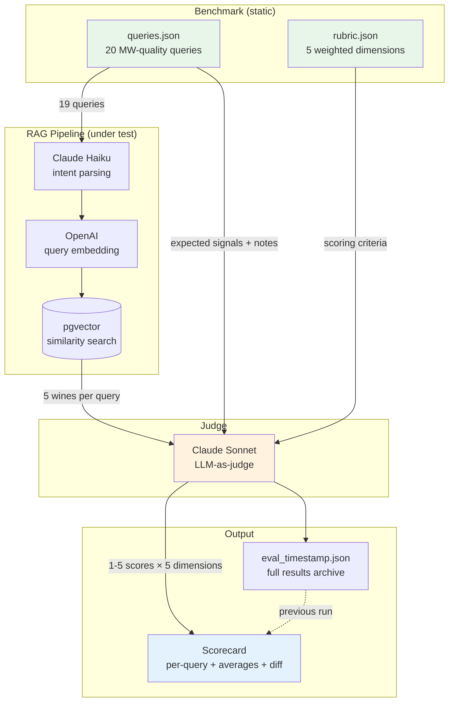

# Recommendations Engine — Spec

Phase 6. Adds the AI layer — pgvector embeddings + Claude Haiku — that turns "SAQ product search" into "wine sommelier."

Phase 6a builds the RAG infrastructure. Phase 6b wires it into the bot (`/recommend`, new arrivals digest). This spec covers both.

Cross-references: [ROADMAP.md](../ROADMAP.md) Phase 6, [DATA_PIPELINE.md](DATA_PIPELINE.md) (prerequisite — availability check + embedding sync), [TELEGRAM_BOT.md](TELEGRAM_BOT.md) (bot commands).

---

## What This Phase Delivers

- Natural language wine recommendations (`/recommend`)
- Semantic search over ~30.9k wine products via pgvector embeddings
- Claude Haiku reasoning over structured wine data (grape, region, price, tasting profiles)
- Availability-aware results (only recommend wines you can actually buy)
- New arrivals digest after monthly scrape, LLM-curated

Out of scope: replacing SAQ.com's search/browse. The bot's edge is **natural language + personalization + proactive intelligence** — not replicating a product catalog.

---

## Data Available for Recommendations

Detailed data sources, schema changes, and pipeline architecture are in [DATA_PIPELINE.md](DATA_PIPELINE.md). Summary of what the recommendation engine consumes:

**From products table (~30.9k wine products):** `name`, `description` (FR marketing text), `category`, `grape`, `region`, `appellation`, `country`, `producer`, `price`, `alcohol`, `sugar`, `rating`, `review_count`, `classification`, `designation`, `online_availability` (daily refresh via `--availability-check`), `store_availability` (daily refresh for Montreal stores via `--availability-check`). Only wine products are embedded (vin + champagne/mousseux + porto/fortifié + saké); spirits, beer, and cider are excluded. Availability, store presence, and price are query-time filters.

**From Adobe Live Search (`--enrich-wines`):** `taste_tag` (SAQ taste profile, from Adobe `pastille_gout`), `tasting_profile` JSONB (`portrait_*` — body, acidity, aromas, sweetness, wood, serving temp, aging potential), `vintage`, `grape_blend` (structured blend with percentages, from Adobe `cepage_text`).

**From watch history:** Implicit taste signal. A user watching 5 Bordeaux reds and 0 whites tells us something. Available for personalization without explicit preference collection.

---

## Architecture Decisions

### pgvector over ChromaDB

Vectors live in PostgreSQL alongside relational data. No dedicated vector database.

**Why:**

- **Hybrid queries in one statement.** "Bold red under $30 at my store" = vector similarity + WHERE on price, category, online_availability, store inventory. One SQL query. ChromaDB would need two round trips + application-level joining.
- **No new service.** `CREATE EXTENSION vector` + Alembic migration. No Docker container eating RAM on a 4GB VPS.
- **Atomic sync.** Embedding on the same row as the product. No sync layer, no consistency headaches.
- **Scale is trivial.** ~30.9k wine rows. pgvector handles millions.

Memory: ~30.9k × 1024 dims × 4 bytes = **~126 MB**. Well within 4GB VPS budget.

### Embedding strategy

Full details in [DATA_PIPELINE.md § Embedding Support](DATA_PIPELINE.md#embedding-support). Key decisions:

**Composite text per product** — built from merged Adobe + HTML data:

```
{taste_tag} | {portrait_corps}, {portrait_sucre}, {portrait_acidite}
{grape_blend} | {region}, {appellation}, {country} | {vintage}
Arômes: {portrait_arome}
{description}
```

`taste_tag` and `portrait_*` are gold — they directly map to how users describe what they want ("bold and dry", "light fruity wine"). `description` provides semantic richness for occasion matching ("hearty stews", "grilled lamb").

Price, availability, and rating are **not embedded** — they go in WHERE clauses. Embedding price would conflate semantic similarity with price proximity. Availability changes daily; embeddings should be stable.

**Model:** `multilingual-e5-large` (1024-d). Handles FR/EN bilingual queries. Runs on CPU for batch embedding; ~30.9k products is small.

**Bilingual eval checkpoint:** After initial embed, run 20 representative queries in both FR and EN. If FR/EN retrieval overlap < 50%, re-evaluate model choice.

**Change detection:** `attribute_hash` + `embedded_hash` on Product. `--embed-sync` computes `attribute_hash`, compares against `embedded_hash`, recomputes embeddings where they differ. Run after monthly scrape only — `--availability-check` doesn't touch embeddings or attributes.

### RAG pipeline

Hybrid retrieval: extract structured filters first, then semantic search within the filtered set.

```
User: "un rouge fruité autour de 25$"
                    ↓
1. Parse intent: category=rouge, price_max=30 (buffer above "25$"), available=true
2. SQL: WHERE category = 'Vin rouge' AND price <= 30
         AND delisted_at IS NULL
         AND (online_availability = true
              OR store_availability IS NOT NULL)  -- available somewhere
         AND (user has preferred store?
              → store_availability @> '["23101"]')  -- at their store
3. pgvector: ORDER BY embedding <=> query_embedding LIMIT 10
4. Pass top 10 candidates with full attributes to Claude
5. Claude selects 3-5 picks with reasoning
```

**Why hybrid:** Price and category are exact constraints — vector similarity shouldn't override "$30" meaning $30. Pre-filtering reduces candidates from ~30.9k wine products to hundreds.

**For users with preferred stores:** add `store_availability` filter to step 2. Adobe populates `store_availability_list` for ALL available products — both `inStock=true` (online) and `En succursale` (store-only). This means "available at your store" filtering works across the full ~11.5k available catalog, not just the ~4k online products. Store presence is boolean (from Adobe) — no exact shelf count, but sufficient for recommendations. **MVP: Montreal stores only** (~64 consumer stores). `--availability-check` refreshes store data for Montreal daily; other regions have stale or no store data.

**Top-k = 10.** Enough diversity for Claude without bloating the prompt.

### Intent parsing

Lightweight parser extracts structured filters from the query before the pgvector call:

- Category keywords: rouge, blanc, rosé, bulles, mousseux, porto, saké, etc. (wine-only scope — reject spirits/beer queries with a helpful message)
- Price signals: "autour de 25$", "moins de 40$", "budget 50$"
- Availability: default "available somewhere" (online OR in stores); narrow to "at your store" for users with a preferred store

Regex + keyword matching for MVP. No LLM call needed for filter extraction — upgrade to Claude tool use only if intent parsing fails too often in practice.

### Claude integration

**Pattern: RAG context injection** — retrieve top-k wines, inject as structured text into Claude's prompt, Claude writes the recommendation.

Tool use (letting Claude call APIs directly) adds latency and non-determinism. Reserve for future features like `/versus` where Claude needs targeted lookups.

**Prompt structure:**

```
System:
You are a sommelier at the SAQ (Société des alcools du Québec).
Recommend wines ONLY from the catalog below. Never invent a wine or a detail.
If no wine fits, say so — don't hallucinate.
Respond in the same language as the user's question.

Catalog ({n} wines):
[1] {name} — {price}$ — {country}, {region} — {grape}
    {taste_tag} · {portrait_corps}, {portrait_sucre}
    Arômes: {portrait_arome}
    {description_excerpt}
    SKU: {sku}
...

User: {query}
```

**Guardrails:**

1. Prompt constraint: "only from the catalog below" — primary defense
2. Post-response SKU validation: extract SKUs from Claude's output, verify they exist in PostgreSQL. If missing → retry without that SKU
3. Graceful degradation on failure (see below)

---

## Conversation Memory

**MVP: in-memory only** — store last 3 turns in `context.user_data` (python-telegram-bot).

- No DB table at 20 users
- Resets on bot restart (acceptable; restarts are infrequent)
- 3 turns ≈ 300 tokens — enough for "something else" / "cheaper" follow-ups

**Upgrade trigger:** add `conversations` + `messages` tables when conversation state needs to survive restarts or a feature requires persistent taste history (`/cellar`, `/taste-profile`). Not now (YAGNI).

---

## Token Budget

Per `/recommend` call with top-k=10:

| Component | Tokens |
|---|---|
| System prompt | ~200 |
| 10 wine cards | ~500 |
| 3-turn history | ~300 |
| User query | ~50 |
| **Total input** | **~1,050** |
| Claude output | ~300 |

At Haiku 4.5 pricing ($0.80/MTok in, $4.00/MTok out): **~$0.002 per call.**

At 20 users × 10 queries/day = **~$0.40/day ≈ $12/month.** Negligible.

**Budget cap:** `CLAUDE_DAILY_BUDGET_USD` env var + lightweight token counter. Alert via Telegram DM at 80% consumed. Prevents runaway costs from bugs.

**Caching:** Not needed at this scale. Implement only if costs spike unexpectedly.

---

## Graceful Degradation

```
/recommend request
  │
  ├─ pgvector available?
  │     ├─ YES → retrieve top-k → Claude
  │     └─ NO  → SQL top results (by rating, filtered) → Claude
  │
  └─ Claude available?
        ├─ YES → natural language response with reasoning
        └─ NO  → SQL results + "AI unavailable, here are top-rated matches"
```

Three levels: full RAG → SQL + Claude → SQL only. The bot always returns something useful.

---

## Planned Features

### `/recommend` — Natural language recommendations

The core Phase 6 command. Handles the full range:

- Taste: "something bold and tannic under $30"
- Occasion: "wine for a BBQ", "gift for belle-mère"
- Budget: "best value red under $25"
- Discovery: "surprise me" (seeded by watch history, biased toward novelty)
- Follow-up: "something like that but cheaper" (conversation memory)

**Product card (upgraded from name + price):**

```
🍷 Château Margaux 2018
   Cabernet Sauvignon / Merlot — Bordeaux, France
   89.00$ ✅ Available at Mont-Royal Est
   Aromatique et souple · mi-corsé, sec

   "A bold, structured Bordeaux that pairs perfectly
   with grilled red meats."

   [👁 Watch]  [🔗 SAQ]
```

Rich cards apply to `/new` and `/random` too — not just `/recommend`.

### New arrivals digest

LLM-curated summary after each monthly scrape.

- Input: products where `created_at` is within the last 7 days
- Claude groups by theme ("Best new reds under $25", "Interesting imports this week")
- Posted to group chat (community feel, social proof)
- Future: per-user personalization based on watch history

### Feature consolidation

Several brainstormed commands are really `/recommend` with different prompts:

| Idea | Maps to |
|---|---|
| `/occasion "wine for a BBQ"` | `/recommend wine for a BBQ` |
| `/budget "best rouge under $40"` | `/recommend best red under $40` |
| `/surprise` | `/recommend surprise me` |

One command, fewer things to learn. Claude interprets intent from natural language.

**Genuinely distinct features (separate commands, future scope):**

- `/versus` — head-to-head comparison (2 SKUs in, structured comparison out)
- `/terroir` — region deep-dive (educational, not recommendation)
- `/blind` — blind tasting game (social, multi-user)
- `/cellar` — personal purchase tracker

---

## Implementation Order

Phase 6a is the RAG infrastructure. Phase 6b wires it into the bot.

**Phase 6a — RAG infrastructure:**

Prerequisite: data pipeline work from [DATA_PIPELINE.md](DATA_PIPELINE.md) — Adobe client, `--availability-check`, `--enrich-wines`, schema migration.

1. pgvector setup + `--embed-sync` CLI flag — incremental embedding (#154)
2. Bilingual eval checkpoint — verify FR/EN retrieval quality before wiring Claude
3. `backend/services/rag_service.py` — retrieval + intent parsing (#155)
4. `backend/services/claude_service.py` — prompt builder + guardrails (#155)
5. `GET /api/recommendations` endpoint — wraps rag_service + claude_service
6. LLM cost logging → `recommendation_log` table (query, tokens_in, tokens_out, latency)

**Phase 6b — Client integration:**

1. Bot `/recommend` handler (#156) — calls endpoint, renders rich product cards
2. `👍/👎` feedback buttons → `recommendation_feedback` table
3. New arrivals digest via Claude (#120) — LLM-curated summary after monthly scrape

---

## Eval + MLOps (Phase 6e)

Automated pipeline improvement via offline evaluation with LLM-as-judge scoring against a rubric-based benchmark.

### Architecture

Standard RAG evaluation pipeline: fixed benchmark → production pipeline → LLM judge → scored report.



Key pattern: a **stronger model** (Sonnet) evaluates a **weaker model's** (Haiku) output against a configurable rubric. This is offline evaluation — no real users, fixed test set, reproducible scores.

### Eval Framework

See `backend/eval/` for implementation.

- **Rubric** (`backend/eval/data/rubric.json`) — scoring dimensions with weights, changeable without code
- **Benchmark queries** (`backend/eval/data/queries.json`) — fixed test set, MW-quality queries
- **Judge** — Sonnet evaluates each query's results on all rubric dimensions (1-5 scale)
- **Report** — per-query scores, weighted averages, diff vs previous run
- **Levers** (`backend/eval/levers.md`) — documents which files to change and their impact/risk

### Automated Pipeline Iteration

Claude Code workflow (not a feature to build — it's a prompt pattern):

1. Run `make eval` → read scored JSON output
2. Read `backend/eval/levers.md` to understand available levers
3. Identify worst-scoring queries, read judge justifications for root cause
4. Change ONE lever (intent prompt, retrieval query, embedding composition, etc.)
5. Re-run `make eval`, compare scores via built-in diff mode
6. Keep if improved, revert if regressed
7. Repeat

### Eval Tracing (v2)

Not yet built. Enables comparing runs across code versions:

- **pipeline_version** — git commit SHA (which code produced these results)
- **dataset_version** — SHA256 of `queries.json` (which test set was used)
- **rubric_version** — SHA256 of `rubric.json` (which scoring criteria were applied)
- **cost_tracking** — Haiku tokens + OpenAI embed tokens + Sonnet judge tokens per run
- **baseline.json** — committed baseline that CI compares against (quality gate)

### Human Feedback

Override file (`backend/eval/data/overrides.json`) for manual score corrections:

- Map `query_id` → human scores + justification
- Eval report shows both judge and human scores when they differ
- Pipeline optimization prioritizes human scores over judge scores
- Builds a human-labeled dataset over time for judge calibration

### Relationship to Phase 7

The eval framework becomes unnecessary when the MCP server (Phase 7) replaces the pipeline. Claude's own wine knowledge replaces the rubric-scored pipeline. The eval work is valuable as:

1. Portfolio evidence of MLOps thinking
2. Comparison data: "Phase 6 scored X, Phase 7 (same queries, human-judged) scored Y"
3. The iteration workflow transfers to any RAG system

---

## Constraints

- **4GB RAM VPS** — pgvector index (~126 MB for ~30.9k wine products) in existing PostgreSQL. No additional service.
- **Wine-scoped** — only wine products are embedded and recommended (vin, champagne/mousseux, porto/fortifié, saké). Matches bot and future React app scope.
- **Montreal MVP** — in-store availability checked for Montreal stores only (~64 consumer stores). Expand by metro area when needed.
- **Solo dev** — two new dependencies (pgvector extension, Claude API). Both well-documented.
- **Legal** — embeddings derived from legally obtained data. No new scraping.
- **Budget** — ~$12/month at 20 users × 10 queries/day. Daily cap prevents runaway costs.
- **Bilingual** — embedding model handles FR↔EN. Claude Haiku is natively bilingual.
- **Portfolio** — "pgvector for hybrid search, Claude Haiku for reasoning" is a clean, defensible architecture story.

---

## Open Questions

1. **Embedding model benchmarking.** `multilingual-e5-large` is the candidate. Needs testing against actual FR/EN wine queries before committing. Fallback: `paraphrase-multilingual-MiniLM-L12-v2` (lighter, broader language support).

2. **Availability as hard vs soft filter.** Default: "available somewhere" (online OR in stores). For users with a preferred store: "available at your store" (filters by `store_availability`). Consider soft for high-rated wines with a "check back" note if users find the filter too restrictive.

3. **`/recommend` trigger.** Explicit command only, or interpret free-text as recommendation queries? Start explicit (avoids false triggers). Could enable free-text after `/recommend` sets context.

4. **Recommendation evaluation.** Proxy metrics: watch-after-recommend rate, 👍/👎 buttons, click-through to SAQ. Manual review during development.
